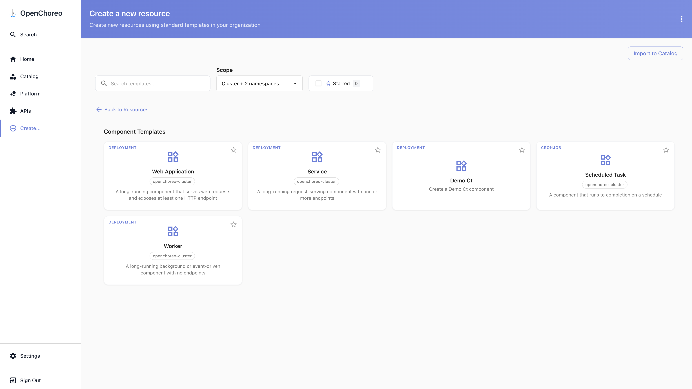
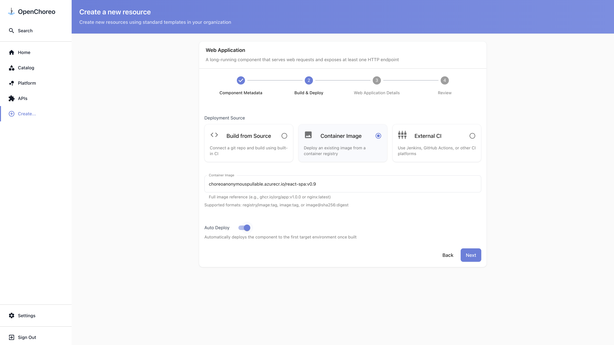
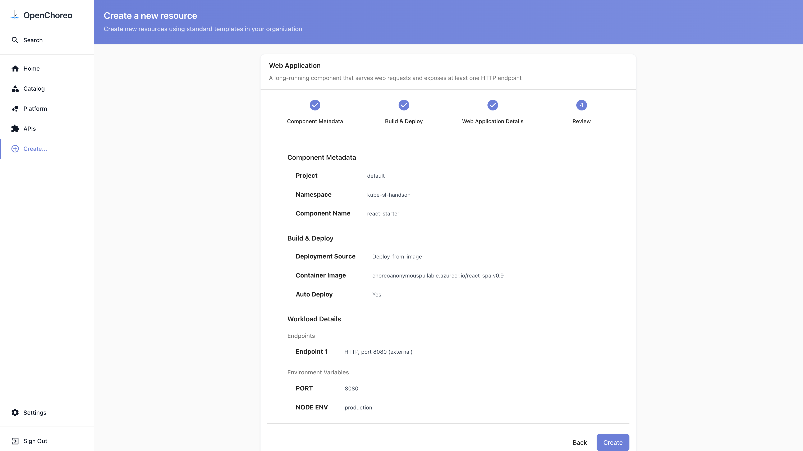
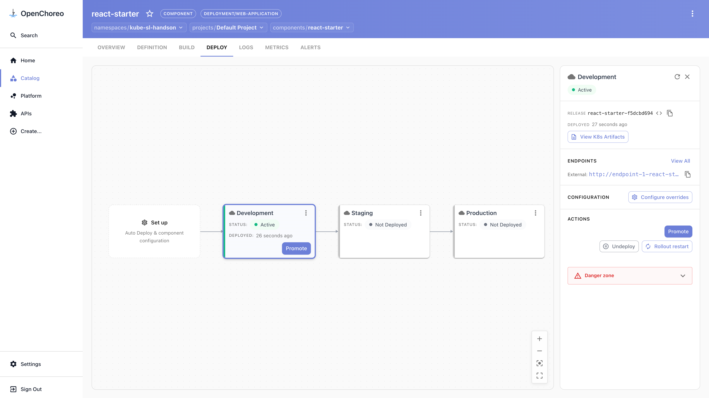
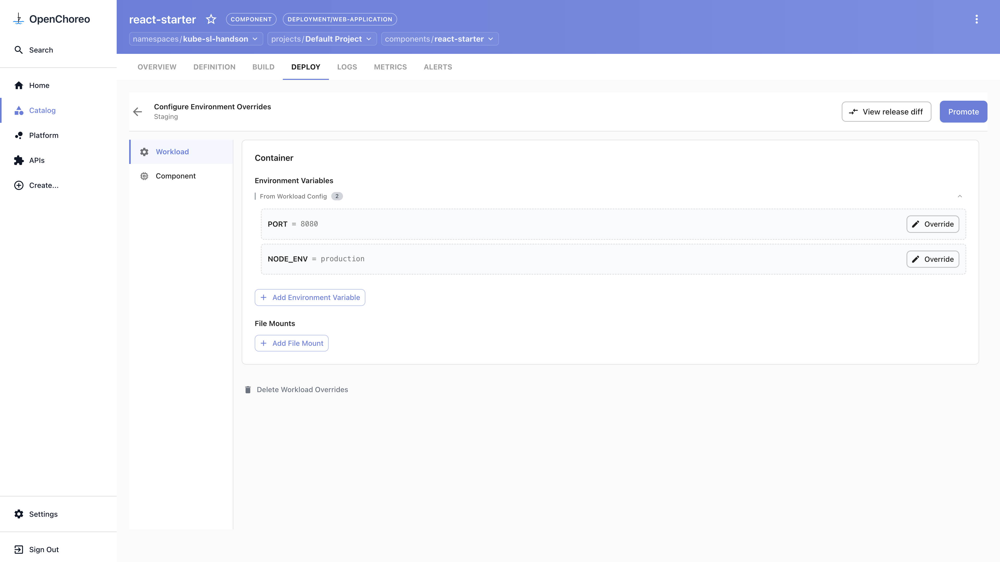
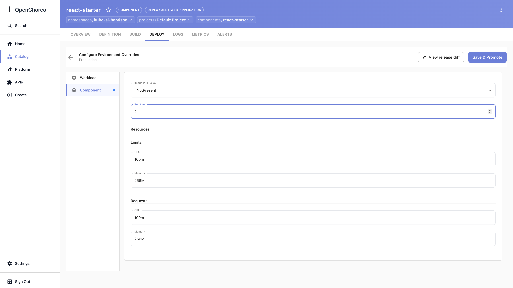
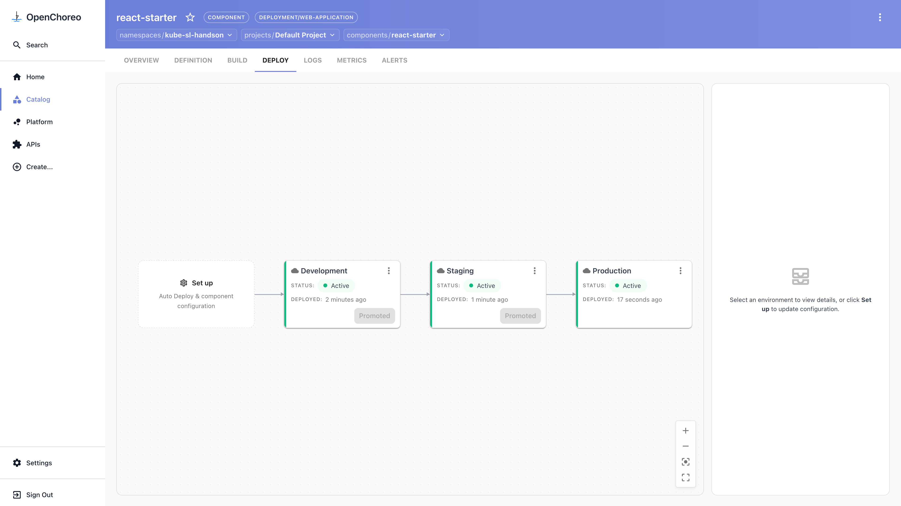

# react-starter: deploy and promote to production

Create a web app in the portal, deploy it, and promote one release from development to
production. About 20 minutes, no YAML and no container build.

> First time? Sign in through the portal first — see [../README.md](../README.md#sign-in).
> Everything goes into your namespace (in this guide: `kube-sl-handson`).

## 1. Create your component

1. Sidebar → **Create…**.
2. Under **Application Resources**, click **Component**, then choose **Web Application**.

   

3. **Component Metadata:** Namespace = your namespace; Project = `default` (fills in
   automatically); Component Name = `react-starter`. Click **Next**.
4. **Build & Deploy:** choose **Container Image**, set the image to
   `choreoanonymouspullable.azurecr.io/react-spa:v0.9`, and tick **Auto Deploy**. Click **Next**.

   

5. **Web Application Details:**
   - Click **Add Endpoint**. The defaults are correct (HTTP, port `8080`, visibility
     **External**). Click **Apply changes**.
   - Click **Add Environment Variable** twice and add `PORT` = `8080` and
     `NODE_ENV` = `production`.
   - Click **Review**.
6. Check the summary, then click **Create** and **View Component**.

   

## 2. Deploy and open your app

1. Open the **DEPLOY** tab and click the **Development** box.
2. It starts **Pending** while the image pulls, then turns **Active** (about 30–60 seconds).
3. In the detail panel under **ENDPOINTS**, click the **External** URL. Your React app opens
   in a new tab.

You described intent — an image and an endpoint — and OpenChoreo generated the Deployment,
Service, and routing and ran it.

## 3. Promote to Staging

1. With **Development** selected, click **Promote**.
2. The overrides screen opens for **Staging**. Leave it as-is and click **Promote**.
3. Select the **Staging** box and wait for **Active**. Same release, its own endpoint URL.

## 4. Promote to Production (scaled up)

1. With **Staging** selected, click **Promote**.
2. Open the **Component** tab. You'll see **Replicas**, CPU, and memory — the per-environment
   knobs. Set **Replicas** to `2`.

   

3. Click **Save & Promote**, review the diff (`replicas: 1 → 2`), and click **Confirm Save**.
4. Select the **Production** box and wait for **Active**. Production runs 2 replicas while
   development and staging run 1 — the same release, scaled up only where you asked.

## What you did

- Created a component from a golden-path template, with no Kubernetes YAML.
- Deployed a prebuilt image and reached the running app.
- Promoted one release through development → staging → production.
- Applied an environment-specific override (replicas) at production only.
