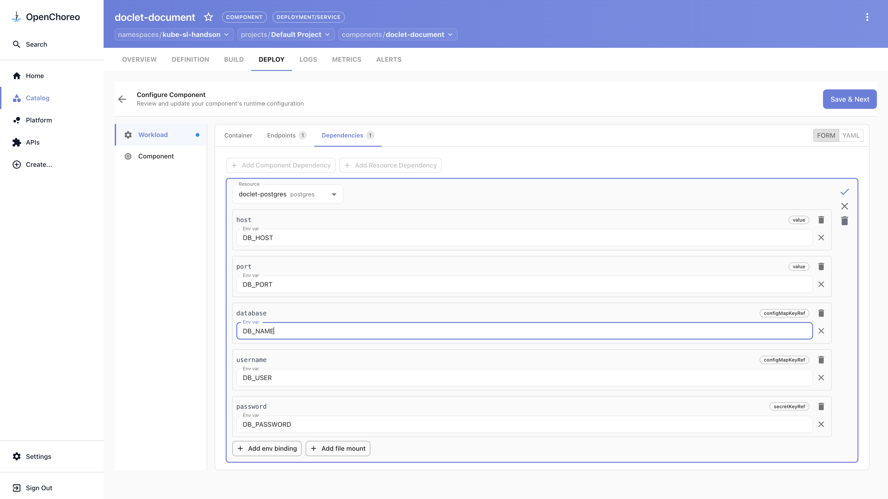
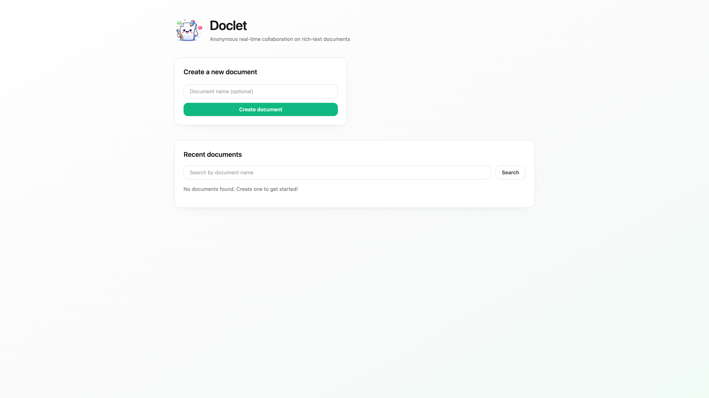
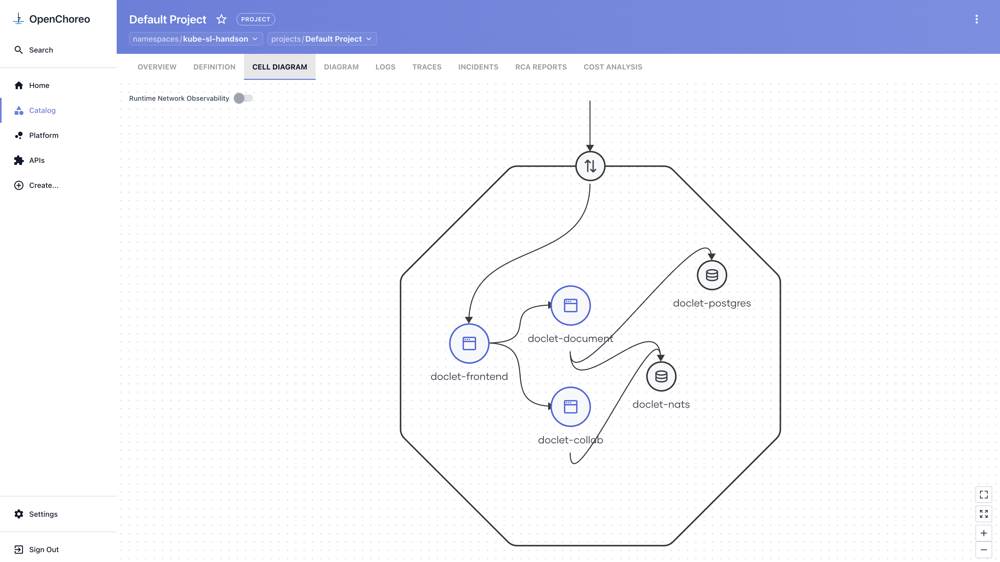

# doclet: a multi-service app with self-service infra (stretch)

Doclet is a real collaborative document editor: a React frontend, two Go services, and managed
**Postgres** and **NATS**. This stretch covers the two things react-starter can't — provisioning
your own infrastructure, and wiring several components together — all in the portal, development
only (no promotion).

> Sign in first if you haven't — see [../README.md](../README.md#sign-in). Everything goes into
> your namespace (in this guide: `kube-sl-handson`, project `default`). The data-plane WebSocket
> policy is a one-time platform setup (already done for you).
>
> **On every Create wizard, set the Namespace dropdown to your namespace.** It defaults to
> `default` each time and doesn't remember your last choice. All five pieces must land in the
> same namespace and project, or the dependency pickers later won't find them.

**Order matters.** A component can only wire to things that already exist, so build bottom-up:
resources → the services that use them → the frontend that uses the services.

The images used below:

| Component | Type | Image | Endpoint |
|---|---|---|---|
| `doclet-postgres` | Resource (postgres) | — | parameter `database = doclet` |
| `doclet-nats` | Resource (nats) | — | — |
| `doclet-document` | Service | `ghcr.io/openchoreo/samples/doclet-document:latest` | HTTP 8080, Project |
| `doclet-collab` | Service | `ghcr.io/openchoreo/samples/doclet-collab:latest` | HTTP 8090, Project |
| `doclet-frontend` | Web Application | `ghcr.io/openchoreo/samples/doclet-frontend:latest` | HTTP 80, External |

---

## 1. Provision the managed resources

**Postgres**
1. Sidebar → **Create…** → **Resource** → **Postgres**.
2. Namespace = your namespace, Name = `doclet-postgres`. **Next**.
3. Set **database** = `doclet`. **Review** → **Create**.
4. Open the resource → **DEPLOY** tab → click **Set up** → **Configure & Deploy** → **Next** → **Deploy**. Wait for Development to show **Active**.

**NATS** — same flow:
1. **Create…** → **Resource** → **Nats**. Namespace = your namespace, Name = `doclet-nats`. **Next** → (no configurable parameters) → **Review** → **Create**.
2. Open it → **DEPLOY** → **Set up** → **Configure & Deploy** → **Next** → **Deploy**. Wait for Development to show **Active**.

Both resources are now running in Development with generated credentials.

---

## 2. Deploy the document service (uses Postgres + NATS)

1. **Create…** → **Component** → **Service**. Namespace = your namespace, Name = `doclet-document`. **Next**.
2. **Build & Deploy:** **Container Image** = `ghcr.io/openchoreo/samples/doclet-document:latest`. Leave **Auto Deploy** off (you'll wire dependencies first). **Next**.
3. **Service Details:** **Add Endpoint** → port `8080`, uncheck **External** (Project-only). **Apply changes**. **Review** → **Create**.
4. Open the component → **DEPLOY** → **Set up** → **Configure & Deploy** → open the **Dependencies** tab.
5. **Add Resource Dependency** → select `doclet-postgres`, then **Add env binding** for each output:

   | Output | Env var |
   |---|---|
   | host | `DB_HOST` |
   | port | `DB_PORT` |
   | username | `DB_USER` |
   | password | `DB_PASSWORD` |
   | database | `DB_NAME` |

   **Apply changes**. (The output picker also lists `url`, `adminURL`, and `adminPassword` — ignore those; you only need the five above.)

   

6. **Add Resource Dependency** again → `doclet-nats` → bind **url** → `DOCLET_NATS_URL`. **Apply changes**.
7. **Save & Next** → **Save & Continue** → **Deploy**. The service starts and connects to the database.

---

## 3. Deploy the collab service (uses NATS)

1. **Create…** → **Component** → **Service**. Namespace = your namespace, Name = `doclet-collab`, image `ghcr.io/openchoreo/samples/doclet-collab:latest`, Auto Deploy off. **Next**.
2. **Add Endpoint** → change the port from `8080` to `8090`, uncheck **External**. **Apply changes**. **Review** → **Create**.
3. Open it → **DEPLOY** → **Set up** → **Configure & Deploy** → **Dependencies**.
4. **Add Resource Dependency** → `doclet-nats` → bind **url** → `DOCLET_NATS_URL`. **Apply changes**.
5. **Save & Next** → **Save & Continue** → **Deploy**.

---

## 4. Deploy the frontend (uses both services)

1. **Create…** → **Component** → **Web Application**. Namespace = your namespace, Name = `doclet-frontend`, image `ghcr.io/openchoreo/samples/doclet-frontend:latest`, Auto Deploy off. **Next**.
2. **Add Endpoint** → change the port from `8080` to `80`, keep **External** checked (this is the public UI). **Apply changes**. **Review** → **Create**.
3. Open it → **DEPLOY** → **Set up** → **Configure & Deploy** → **Dependencies**.
4. **Add Component Dependency** → Component `doclet-document`, Endpoint `endpoint-1`, Visibility `Project`, **Address Env Var** = `DOC_SERVICE_URL`. **Apply changes**.
5. **Add Component Dependency** → Component `doclet-collab`, Endpoint `endpoint-1`, Visibility `Project`, **Address Env Var** = `COLLAB_SERVICE_URL`. **Apply changes**.
6. **Save & Next** → **Save & Continue** → **Deploy**.

---

## 5. Open your app

1. On the frontend's **DEPLOY** tab, select **Development** and click the **External** endpoint URL. Doclet opens — create and edit a document.

   

2. Open the **project** (breadcrumb → your project) and the **Cell Diagram** tab to see the whole thing wired together: external traffic → frontend → the two services → Postgres and NATS.

   

---

## What you did

- Provisioned two managed resources (Postgres, NATS) on demand — no tickets.
- Deployed three components and wired them to resources (env-var bindings) and to each other
  (endpoint dependencies), entirely in the portal.
- Stood up a real multi-service application in your namespace, development only.

The deployable sample also lives in the main repo at `openchoreo/samples/from-image/doclet/` if
you'd rather read the full resource model in YAML.
